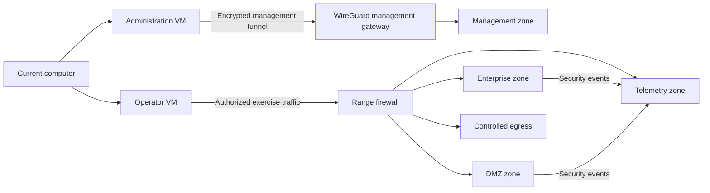

# Planned Range Architecture

## Purpose

The range combines offensive practice with defensive telemetry so that each exercise can show the complete path from authorization and discovery through remediation and retesting.

## Logical Design

## Planned Roles

- **Proxmox tower:** compute, snapshots, isolated virtual networks, and recovery.
- **Range firewall:** routing, policy enforcement, VPN termination, controlled NAT, and traffic logging.
- **Administration VM:** management-only workstation on the current computer.
- **Operator VM:** separate testing workstation used for authorized exercises.
- **Enterprise targets:** a small fictional Windows domain and representative member systems.
- **DMZ targets:** intentionally vulnerable, disposable services.
- **Telemetry systems:** Wazuh and optional network or endpoint sensors.

## Design Principles

- Management and offensive activity use separate workstations and identities.
- Vulnerable systems cannot initiate connections to the household network.
- East-west traffic is denied unless a scenario requires and documents it.
- Targets are disposable and restored from known snapshots.
- Evidence is generated from fictional identities and synthetic traffic.
- Architecture documentation distinguishes planned, implemented, and verified states.
